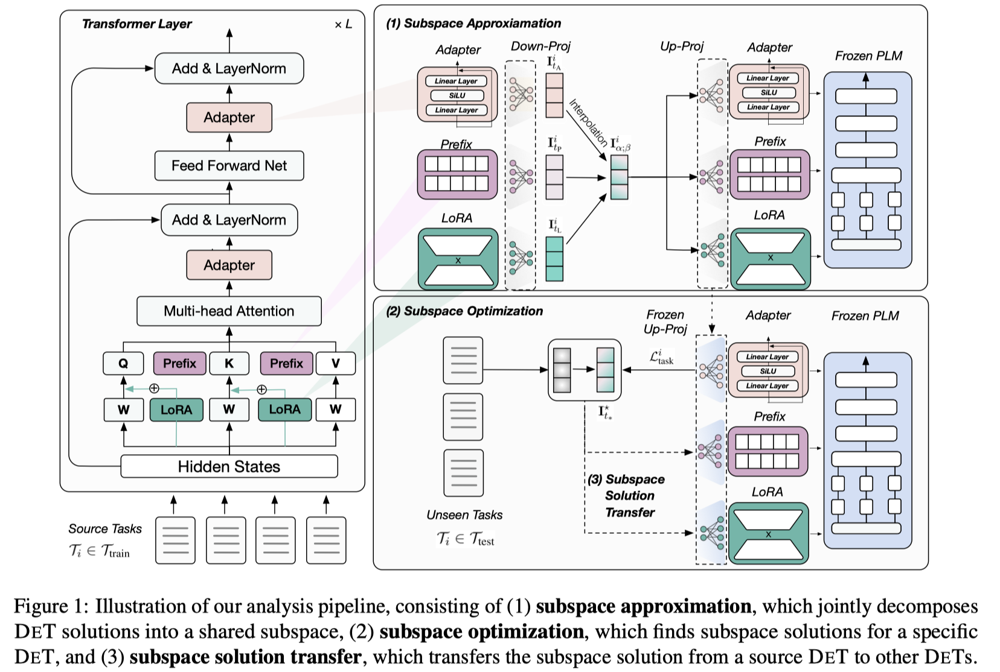
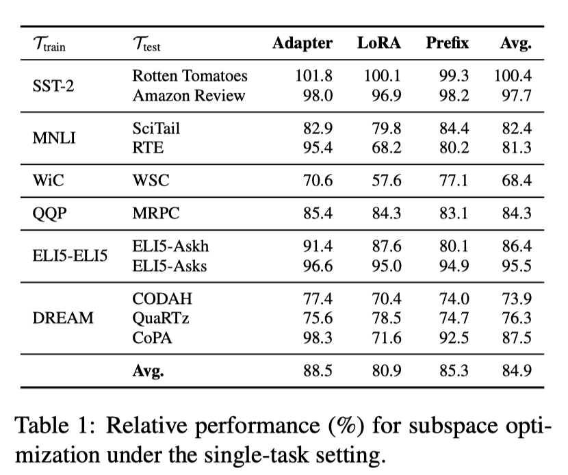
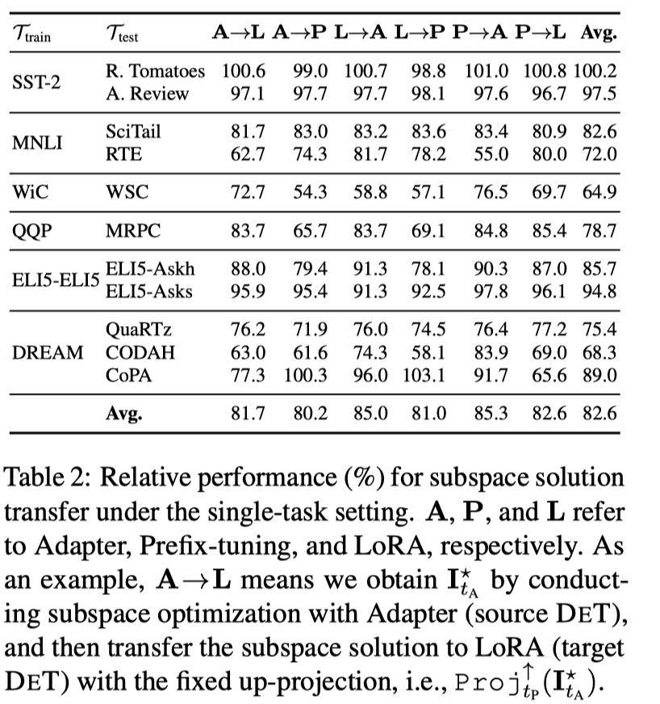
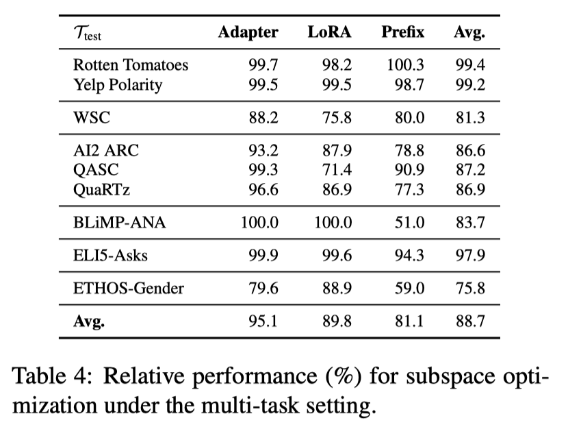
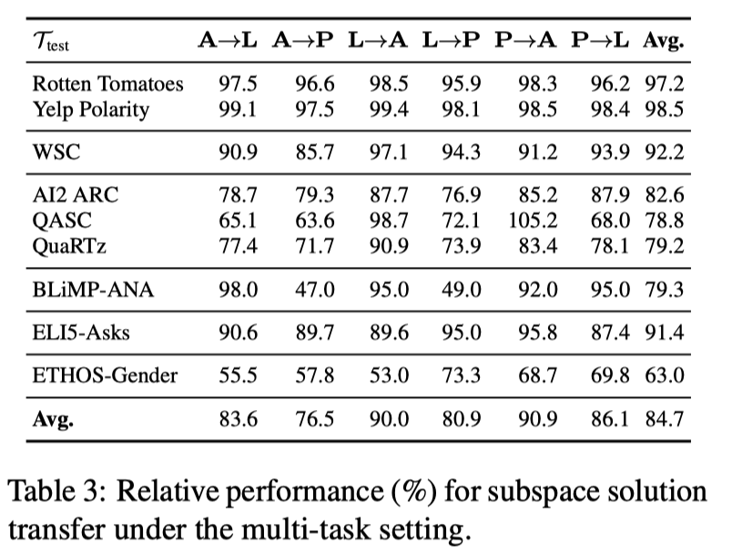

# Different Tunes Played with Equal Skill: Exploring a Unified Optimization Subspace for Delta Tuning

This is the implementation of the paper "[Different Tunes Played with Equal Skill: Exploring a Unified Optimization Subspace for Delta Tuning](https://arxiv.org/pdf/2210.13311.pdf)"

To clone the repository, please run the following command:

```bash
git clone https://github.com/thunlp/Unified-DeltaTuning --depth 1
```

If you use the code, please cite the following paper:

```

```

# Quick Links
+ [Overview](#overview)

+ [Requirements](#requirements)

+ [Data Preparation](#data-preparation)

+ [Experiments](#experiments)

  + [Single-task Setting](#Single-task-Setting)
  + [Multi-task Setting](#Multi-task-Setting)

# Overview
<center>

</center>
In this work, we explore the connections among different DETs(Delta tuning, also known as parameter-efficient tuning) by conducting optimization within the subspace. We find that, for a certain DET, conducting optimization simply in the sub-space could achieve comparable performance to its original space, and the found solution in the subspace could be transferred to another DET and achieve non-trivial performance.

# Requirements

To set up the dependencies, you can run the following command:
``` bash
pip install -r requirements.txt
```
NOTE: Different versions of packages (like pytorch, transformers, etc.) may lead to different results from the paper. However, the trend should still hold no matter what versions of packages you use.

# Data Preparation
We pack the original 160 datasets here. Please download it from "[here](https://cloud.tsinghua.edu.cn/f/23dee716b51f45988c2f/?dl=1)" and extract the files to ./data

# Experiments

We pack original DETs and fine-tuning checkpoints of tasks in our experiments. Please download it and extract the files to ./models

## Single-task Setting
We take Sentiment Analysis tasks for example here.

### Subspace Approximation
```bash
bash scipts/train_singletask-glue-sst2.sh
```
```bash
cd ../src

TASKS="glue-sst2"
DATA_DIR=data
TUNE_METHOD=PET_mc
ADAPTER_SIZE=12
LORA_SIZE=10
PREFIX_R=24
PREFIX_NUM=120
LOW_DIMENSION=4
SAVE_PATH=models
IDENTIFIER=full_data_PET_mc_singleTask
PRETRAINED_MODEL_PATH=pretrained_models
GPU=3
ALPHA=0.1

for TASK in $TASKS
do

echo "Task: $TASK, Identifier: $IDENTIFIER"

CUDA_VISIBLE_DEVICES=${GPU} \
MKL_NUM_THREADS=1 OMP_NUM_THREADS=1 \
python tune_hps_singletask_PET_mode_connectivity.py \
--task_dir ${DATA_DIR}/${TASK} \
--do_train \
--do_predict \
--learning_rate_list 1e-4 \
--bsz_list 8 \
--train_iters 100000 \
--model ${PRETRAINED_MODEL_PATH}/t5.1.1.lm100k.base \
--tokenizer_path ${PRETRAINED_MODEL_PATH}/t5-v1_1-base \
--output_dir ${SAVE_PATH}/${IDENTIFIER}/${TASK}-r_${LOW_DIMENSION}-recon_alpha_${ALPHA} \
--predict_batch_size 40 \
--one_prefix \
--tune_method ${TUNE_METHOD} \
--valid_interval 1000 \
--output_interval 1000000 \
--log_interval 100 \
--early_stop -1 \
--quiet \
--apply_adapter \
--adapter_type houlsby \
--adapter_size ${ADAPTER_SIZE} \
--apply_lora \
--lora_alpha 16 \
--lora_r ${LORA_SIZE} \
--apply_prefix \
--prefix_r ${PREFIX_R} \
--prefix_num ${PREFIX_NUM} \
--load_stage1_adapter_path_list models/full_data_adapter/${TASK}-adapter_size_12-seed_42/lr_0.0005_bsz_16_seed_42/checkpoint-best.pt \
--load_stage1_lora_path_list models/full_data_lora/${TASK}-lora_size_10-seed_42/lr_0.0005_bsz_16_seed_42/checkpoint-best.pt \
--load_stage1_prefix_path_list models/full_data_prefix/${TASK}-r_24-num_120-SGD_noise_seed_42/lr_0.0005_bsz_16_seed_42/checkpoint-best.pt \
--low_dimension ${LOW_DIMENSION} \
--reconstruct_alpha ${ALPHA} \
--choose_valid \
--choose_valid_lines 1000 \
done

```
Most arguments are inherited from `transformers` and are easy to understand. We further explain some arguments:

* `tune_method`: There are 2 modes
  * `PET_mc`: Subspace Approximation.
  * `PET_mc_stage2`: Subspace Optimization and Subspace Solution Transfer at the same time.
* `low_dimension`: The dimension of subspace.
* `reconstruct_alpha`: ratio between reconstruction loss and original task loss.
* `load_stage1_adapter(lora/prefix)_path_list`: The path of checkpoints we load from ./models.

Other arguments `apply_adapter`, `adapter_type`, `adapter_size`, `apply_lora`, `lora_alpha`, `lora_r`, `apply_prefix`, `prefix_r`, `prefix_num` are classical arguments for DETs and we keep them persistent in all main experiments.


### Subspace Optimization and Subspace Solution Transfer
Subspace Optimization for adapter and transfer adapter's subspace solution to lora and prefix.

```bash
bash sricpts/transfer_singletask_adapter-from-glue-sst2.sh
```

The different argument from Subspace Approximation is `load_PET_enc_dec_path`,  from which we load checkpont to get the subspace.

<center>

<center>


## Multi-task Setting

### Subspace Approximation
```bash
bash scipts/train_60tasks-multigpu.sh
```

```
cd ../src

DATA_DIR="data"
TUNE_METHOD=PET_mc
ADAPTER_SIZE=12
LORA_SIZE=10
PREFIX_R=24
PREFIX_NUM=120
LOW_DIMENSION=100
SAVE_PATH=models
IDENTIFIER=full_data_PET_mc_multitask_multigpu
PRETRAINED_MODEL_PATH=pretrained_models
TASK_SPLIT=train_60_unseen_rest
NPROC_PER_NODE=4
GPU=4,5,6,7

echo "Task: $TASK, Identifier: $IDENTIFIER"

CUDA_VISIBLE_DEVICES=${GPU} \
MKL_NUM_THREADS=4 OMP_NUM_THREADS=1 \
python -m torch.distributed.launch --master_port 88888 --nproc_per_node ${NPROC_PER_NODE} tune_hps_multitask_PET_mode_connectivity_multigpu.py \
--task_dir ${DATA_DIR} \
--do_train \
--do_predict \
--custom_tasks_splits dataloader/custom_tasks_splits_PET_mc/${TASK_SPLIT}.json \
--learning_rate_list 1e-4 \
--bsz_list 4 \
--train_epochs 1 \
--train_lines_each_task 20000 \
--dev_lines_each_task 240 \
--model ${PRETRAINED_MODEL_PATH}/t5.1.1.lm100k.base \
--tokenizer_path ${PRETRAINED_MODEL_PATH}/t5-v1_1-base \
--output_dir ${SAVE_PATH}/${IDENTIFIER}/${DATA_DIR}_${TASK_SPLIT}_${NPROC_PER_NODE}gpu-lr_1e-4-delta_R-train_2w_lines-recon_alpha_10 \
--predict_batch_size 40 \
--one_prefix \
--tune_method ${TUNE_METHOD} \
--valid_interval 1000 \
--output_interval 10000000 \
--log_interval 100 \
--early_stop -1 \
--quiet \
--apply_adapter \
--adapter_type houlsby \
--adapter_size ${ADAPTER_SIZE} \
--apply_lora \
--lora_alpha 16 \
--lora_r ${LORA_SIZE} \
--apply_prefix \
--prefix_r ${PREFIX_R} \
--prefix_num ${PREFIX_NUM} \
--low_dimension ${LOW_DIMENSION} \
--load_PET_dir models \
--gpu_num ${NPROC_PER_NODE} \
--reconstruct_alpha 10 \

```

* `custom_tasks_splits`: Multi task set obtained by random segmentation.
* `train_lines_each_task`: Sampling number of rows for every task in training.
* `dev_lines_each_task`: Sampling number of rows for every task in validation.

For Subspace Approximation in the multi-task setting, We use 4 `A100` for distributed training.

### Subspace Optimization and Subspace Solution Transfer
Subspace Optimization for adapter and transfer adapter's subspace solution to lora and prefix.

```bash
bash sricpts/transfer_multitask_adapter.sh
```
<center>

<center>

